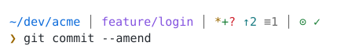
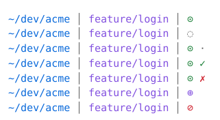
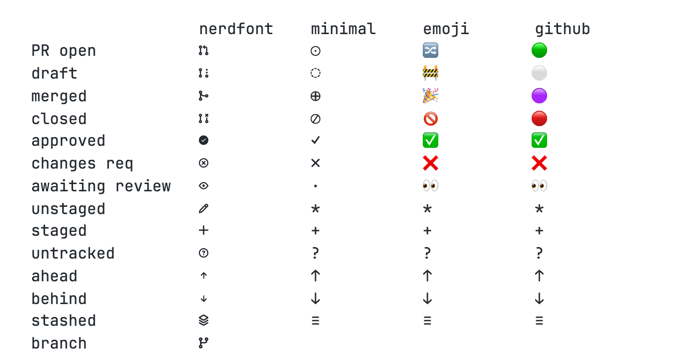

```
 ▗▄▄▖ ▗▄▖ ▗▖ ▗▖ ▗▄▄▖▗▄▄▄▖
▐▌   ▐▌ ▐▌▐▌ ▐▌▐▌   ▐▌
▐▌▝▜▌▐▛▀▜▌▐▌ ▐▌▐▌▝▜▌▐▛▀▀▘
▝▚▄▞▘▐▌ ▐▌▝▚▄▞▘▝▚▄▞▘▐▙▄▄▖
```

# GAUGE

*An instrument panel for your shell — read the repo and its pull request without
looking, like glancing at a dial.*

A small, dependency-light zsh prompt that shows your git working-tree state **and
the status of the branch's GitHub pull request** — open, draft, merged, closed,
approved, changes requested — without ever blocking your shell.

PR data comes from the [`gh` CLI](https://cli.github.com/), is fetched in a
background job, cached on disk, and painted into the prompt the moment it
arrives (the prompt redraws itself via `SIGUSR1`).

<picture>
  <source media="(prefers-color-scheme: dark)" srcset="assets/prompt-dark.svg">
  
</picture>

Path, branch, working-tree flags, then PR state — here: open and approved. The
`│` separators are dim, so they mark where each group ends without competing
with its contents. `GAUGE_GROUP_STYLE=parens` gets you `(feature/login *+? ↑2 ≡1)`
instead, and `GAUGE_SYMBOLS[separator]` changes the character.

Two deliberate omissions keep the line to what you can't already see:

- **Status above, cursor below.** Your input starts at the same column however
  deep the path or long the branch name, so nothing wraps unpredictably.
  `GAUGE_PROMPT_NEWLINE=0` for a single line.
- **No username.** It never changes on your own machine. It appears as
  `you@host` over SSH and in red as root — the two cases where it matters.
  `GAUGE_SHOW_USER=1` to always show it, `0` never.

With a Nerd Font installed you get GitHub's real Octicon glyphs instead of the
geometric ones — single-width characters, not emoji. Detection is automatic; see
[Symbols](#symbols).

## Symbols

Every pull request state, in the colors the prompt actually uses — open, draft,
awaiting review, approved, changes requested, merged, closed:

<picture>
  <source media="(prefers-color-scheme: dark)" srcset="assets/states-dark.svg">
  
</picture>

The default is **`GAUGE_SYMBOL_SET=auto`**: real GitHub icon glyphs if your
terminal has a Nerd Font, and the geometric set if it doesn't — so it looks
right out of the box either way, with no tofu boxes.

Every symbol in every preset. This one is a PNG rather than an SVG on purpose:
the `nerdfont` glyphs live in the Unicode Private Use Area, so as *text* they
would only render for readers who already have a Nerd Font — here the shapes are
baked in, so you can see what you would be choosing.

<picture>
  <source media="(prefers-color-scheme: dark)" srcset="assets/presets-dark.png">
  
</picture>

| | `nerdfont` | `minimal` (fallback) | `emoji` | `github` |
|---|---|---|---|---|
| **needs** | a Nerd Font | nothing | emoji font | emoji font |
| **width** | 1 cell | 1 cell | 2 cells | 2 cells |

- **`nerdfont`** — GitHub's *actual* icon set. These are real Octicons, single
  characters rather than emoji, so they're single-width and take your theme
  colors: `nf-oct-git_pull_request` U+F407, `…_draft` U+F4DD,
  `nf-oct-git_merge` U+F419, `…_closed` U+F4DC, `nf-oct-check_circle_fill`
  U+F4A4, `nf-oct-x_circle` U+F52F, `nf-oct-eye` U+F441. Bundled in every
  [Nerd Font](https://nerdfonts.com) — same family Starship and powerlevel10k
  draw from. Install one with
  `brew install --cask font-jetbrains-mono-nerd-font`, set it as your terminal
  font, then run `gauge-font-check`.
- **`minimal`** — plain Unicode geometry. Renders in any font, no install. Also
  the backstop preset: it supplies any key another preset leaves undefined.
- **`emoji`** / **`github`** — for terminals without a patched font where you'd
  rather have color than precision. `github` mirrors GitHub's own state colors
  (open green, draft gray, merged purple, closed red).

Run **`zsh tools/preview.zsh`** to see all four rendered in your own terminal
and font, then pick with `GAUGE_SYMBOL_SET=nerdfont` (or `auto` to keep the
detection).

`nerdfont` restyles the local flags too — a pencil for modified, a plus for
staged, and so on, all visible in the image above. Every preset shares these
meanings:

| Symbol | Color | Meaning |
|--------|-------|---------|
| `*` | yellow | unstaged changes to tracked files |
| `+` | green | staged changes |
| `?` | red | untracked files |
| `↑n` / `↓n` | cyan | commits ahead of / behind upstream |
| `≡n` | dim | stash entries |

Each flag is colored by what it *means* — work in progress, staged and ready,
not tracked, remote-related, background — so a run like `*+? ↑2 ≡1` is
recognised at a glance instead of read. `GAUGE_FLAG_COLORS=0` puts them all back
in one color (`GAUGE_COLORS[flags]`).

## Requirements

- zsh 5.3+
- git
- [`gh`](https://cli.github.com/) authenticated (`gh auth login`) — optional; the
  git part works fine without it, and the PR segment simply stays empty.

## Install

**Manual**

```bash
git clone https://github.com/allvot/gauge.git ~/.zsh/gauge
echo 'source ~/.zsh/gauge/gauge.plugin.zsh' >> ~/.zshrc
```

Or run the bundled installer from the clone, which backs up your `~/.zshrc`
first and appends the `source` line only if it isn't already there:

```bash
./install.sh
```

**oh-my-zsh**

```bash
git clone https://github.com/allvot/gauge.git \
  ${ZSH_CUSTOM:-~/.oh-my-zsh/custom}/plugins/gauge
# then add gauge to plugins=(...) in ~/.zshrc
```

**zinit** — `zinit light allvot/gauge`

**antidote / zplug** — add `allvot/gauge` to your plugin list.

## Configuration

Set any of these **before** sourcing the plugin. Defaults shown.

| Variable | Default | Purpose |
|----------|---------|---------|
| `GAUGE_SYMBOL_SET` | `auto` | `auto` / `nerdfont` / `minimal` / `emoji` / `github` |
| `GAUGE_HAS_NERDFONT` | *detected* | Force detection: `1` yes, `0` no |
| `GAUGE_SHOW_REVIEW_PENDING` | `1` | Show the "awaiting review" icon |
| `GAUGE_PR_ENABLED` | `1` | Set `0` to disable all `gh` queries |
| `GAUGE_PR_CACHE_TTL` | `30` | Seconds before a cached PR answer is refreshed |
| `GAUGE_PR_CACHE_DIR` | `$TMPDIR/gauge-cache` | Cache location |
| `GAUGE_ASYNC_REDRAW` | `1` | Redraw the prompt when PR data lands |
| `GAUGE_SET_PROMPT` | `1` | Set `0` to keep your own `PROMPT` (see below) |
| `GAUGE_PROMPT_NEWLINE` | `1` | Cursor on its own line below the status |
| `GAUGE_SHOW_USER` | `auto` | `auto` = over SSH or as root only; `1` always, `0` never |
| `GAUGE_FLAG_COLORS` | `1` | Color each local flag by meaning, not all as one |
| `GAUGE_GROUP_STYLE` | `separator` | `separator` = dim `│` between groups; `parens` = `(branch flags)` |
| `GAUGE_TITLE` | `1` | Set the terminal/tab title to `repo:branch` |
| `GAUGE_BIND_CLEAR` | `1` | Bind `^L` to clear scrollback and redraw in full |
| `GAUGE_SHOW_STASH` | `1` | Show the `≡n` stash counter |
| `GAUGE_SHOW_UNTRACKED` | `1` | Show the `?` untracked marker |
| `GAUGE_SKIP_BRANCHES` | `(main master production)` | Branches never queried for a PR |

Symbols and colors are associative arrays — override individual keys only:

```zsh
typeset -A GAUGE_SYMBOLS=(pr_open '●' pr_merged '✔')
typeset -A GAUGE_COLORS=(branch cyan flags 214)
source ~/.zsh/gauge/gauge.plugin.zsh
```

Colors accept anything zsh's `%F{...}` accepts: names (`red`, `cyan`) or
256-color numbers (`242`).

### Using your own PROMPT

The git segment is exported as `$GAUGE_GIT_INFO`, already colored and refreshed on
every `precmd`. Drop it wherever you like:

```zsh
GAUGE_SET_PROMPT=0
source ~/.zsh/gauge/gauge.plugin.zsh
PROMPT='%F{green}%n@%m%f %F{blue}%~%f${GAUGE_GIT_INFO}
❯ '
```

`setopt prompt_subst` is required (the plugin sets it).

## Clearing the screen

A terminal-level clear — ⌘K in Tabby and Ghostty — wipes the buffer and keeps
only the row the cursor is on. It knows nothing about the status line above it,
so with a two-line prompt you lose the path, branch and PR state.

Two defenses, both on by default:

- **The title.** `GAUGE_TITLE=1` puts `repo:branch` in the window and tab title,
  where no clear can touch it. Works in every terminal and costs nothing
  visually.
- **`^L`.** The plugin binds it to `gauge-clear-screen`, which drops the scrollback
  (`\e[3J`, the part ⌘K does that plain `^L` doesn't) and then redraws *every*
  prompt line. Same result as ⌘K, context intact. If your `^L` is already bound
  to something other than the stock widget, the plugin leaves it alone.

To get that from ⌘K itself, remap the key to send `^L`:

```
# ~/.config/ghostty/config
keybind = cmd+k=text:\x0c
```

Tabby has no send-text action, so ⌘K there can only be a buffer clear — either
lean on the title, or free ⌘K in Settings → Hotkeys (it's bound to `clear`) and
use `^L`.

## Commands

- **`gauge-legend`** — print every symbol the prompt can show and what it means,
  as a table. Reflects your *live* configuration: the resolved preset, your
  colors, and anything switched off. Forgot what a glyph means? This is the
  answer.

  ```
  gauge-legend            symbols and meanings, grouped
  gauge-legend --keys     also the GAUGE_SYMBOLS key to override
  gauge-legend --codes    also the Unicode codepoint
  gauge-legend --all      all four presets side by side
  ```

  ```
    gauge  preset: nerdfont (auto — Nerd Font detected)
    ~/repo │  feature/x │   2 │

    Pull request
       open                          pr_open           U+F407
       draft — not ready for review  pr_draft          U+F4DD
       merged                        pr_merged         U+F419
       closed without merging        pr_closed         U+F4DC

    Review
       approved                      review_approved   U+F4A4
       changes requested             review_changes    U+F52F
       awaiting review               review_pending    U+F441
  ```

- `gauge-pr-cache-clear` — drop every cached PR answer; useful right after
  opening, approving, or merging a PR if you don't want to wait out the TTL.
- `gauge-font-check` — re-run Nerd Font detection and print sample glyphs. Run it
  after installing a font or changing your terminal font. `gauge-font-check --yes`
  / `--no` overrides the guess permanently.

## Picking different glyphs

`tools/glyphs.zsh` browses 357 git-, PR- and review-related glyphs bundled from
the Nerd Fonts index — Octicons, Codicons, Font Awesome, Devicons, Material —
with names and codepoints, so you can shop for a better character:

```bash
zsh tools/glyphs.zsh pull_request   # filter by name
zsh tools/glyphs.zsh merge
zsh tools/glyphs.zsh --families
```

Seeing a glyph in your prompt and not sure what it is? Ask — it takes a pasted
character, `f407`, or `U+F407`, and tells you the name and which prompt symbol
uses it:

```bash
zsh tools/glyphs.zsh --what        # →  U+F418  oct-git_branch
                                    #    → used by this prompt as branch_prefix
```

Then override just the keys you want, before sourcing the plugin:

```zsh
typeset -A GAUGE_SYMBOLS=(
  pr_open   $'\uea64'   # cod-git_pull_request  — VS Code's take
  pr_draft  $'\uebdb'   # cod-git_pull_request_draft
  pr_merged $'\ueafe'   # cod-git_merge
  pr_closed $'\uebda'   # cod-git_pull_request_closed
)
source ~/.zsh/gauge/gauge.plugin.zsh
```

Overridable keys: `pr_open` `pr_draft` `pr_merged` `pr_closed`
`review_approved` `review_changes` `review_pending` `dirty` `staged`
`untracked` `ahead` `behind` `stash` `branch_prefix` `separator` `prompt_char`.

## How it works

1. `precmd` runs `vcs_info` for the branch name and a handful of cheap local
   `git` calls for the flag string. No network.
2. The PR segment is read straight from a per-repo-and-branch cache file, so the
   prompt is drawn immediately even on a cold cache.
3. If the cache entry is older than `GAUGE_PR_CACHE_TTL`, a disowned background
   job runs `gh pr view --json state,isDraft,reviewDecision`, writes the
   rendered segment atomically, and sends `SIGUSR1` to the shell, which triggers
   `zle reset-prompt`.

The cache file is touched before the query is launched, so several terminals in
the same repo don't stampede the GitHub API.

## Troubleshooting

**No PR icon appears.** Check `gh auth status`, and that the branch isn't in
`GAUGE_SKIP_BRANCHES`. Then verify the query directly:

```bash
gh pr view "$(git branch --show-current)" --json state,isDraft,reviewDecision
```

**Boxes (□) or blanks instead of icons — or only *some* glyphs missing.** First
find out whether the font actually has them:

```bash
python3 tools/font-coverage.py           # scans installed Nerd Fonts
```

If it reports every glyph present but your terminal still shows boxes, the
terminal isn't using that font. The usual cause is the **family name**: Homebrew's
casks register nameID 1 as the short form, e.g. `JetBrainsMono NFM` (`NF` =
proportional, `NFM` = mono, `NFP` = propo), while `JetBrainsMono Nerd Font Mono`
exists only as nameID 16. Terminals that match on nameID 1 — anything built on
xterm.js, such as Tabby or VS Code — fall back **per character** when given the
long name, which renders some glyphs and drops others. Use the short name:

```bash
python3 tools/font-coverage.py --names ~/Library/Fonts/YourFont.ttf
```

To give up on glyphs entirely, `gauge-font-check --no` pins the geometric set;
then `exec zsh`.

**Prompt feels slow.** The git flag calls are the only synchronous work. In very
large repos, `GAUGE_SHOW_UNTRACKED=0` is usually the biggest win.

**Prompt doesn't refresh on its own.** Something else in your config may already
define `TRAPUSR1`; the plugin deliberately does not override it. Either remove
that handler or set `GAUGE_ASYNC_REDRAW=0` and accept a one-prompt lag.

## Development

```bash
zsh test/smoke_test.zsh          # the whole suite, no network, no ~/.zshrc
zsh tools/preview.zsh            # every preset, in your own font
zsh tools/samples.zsh states     # the README examples, in your terminal
```

The images in `assets/` are generated from the prompt's own renderers, so they
can't drift from the code — nothing in `tools/samples.zsh` hardcodes a layout or
a color. GitHub strips ANSI from code blocks and sanitizes inline `style`, so a
colored example has to be an image; SVG keeps it diffable instead of a
screenshot. Regenerate after any color or symbol change:

```bash
for theme in dark light; do
  zsh tools/samples.zsh prompt | python3 tools/ansi2svg.py --theme $theme \
    --title 'gauge: path, branch, working-tree flags, PR state' > assets/prompt-$theme.svg
  zsh tools/samples.zsh states | python3 tools/ansi2svg.py --theme $theme \
    --title 'gauge: every pull request state' > assets/states-$theme.svg
  zsh tools/samples.zsh presets | python3 tools/ansi2svg.py --theme $theme \
    --title 'Every symbol in every preset: nerdfont, minimal, emoji, github' > assets/presets-$theme.svg
  tools/svg2png.sh assets/presets-$theme.svg    # needs Chrome + a Nerd Font
done
```

The test suite regenerates every SVG into a temp file and diffs, so a stale
image fails the build rather than quietly misleading readers.

The presets table ships as a **PNG** as well, and it's the one the README shows.
Nerd Font glyphs live in the Private Use Area, so as SVG *text* they'd render
only for readers who already have such a font installed — precisely the people
who don't need the picture. `tools/svg2png.sh` rasterizes through headless
Chrome on a machine that has the font, which bakes the shapes in for everyone
and picks up color emoji at the same time. Its SVG stays committed as the
diffable source the test checks.

## License

MIT — see [LICENSE](LICENSE).
